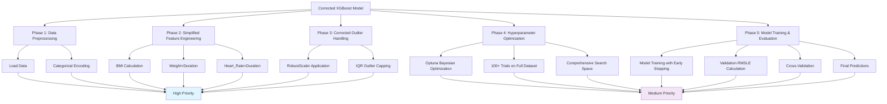

# Corrected XGBoost Implementation Plan - Visual Overview

## Priority Classification

### High Priority Items
- Data loading and preprocessing
- Simplified feature engineering (BMI, Weight×Duration, Heart_Rate×Duration)
- Corrected outlier handling (RobustScaler, IQR capping)

### Medium Priority Items
- Hyperparameter optimization (100+ trials with full dataset)
- Model training and evaluation
- Cross-validation implementation
- Final prediction generation

## Implementation Flow

## Key Improvements Over Enhanced Approach

### Simplified Architecture
- Reduced feature complexity from 15+ engineered features to just 3 core features
- Removed conflicting log transformation and custom objective implementation
- Streamlined outlier handling applied after feature engineering

### Efficient Optimization
- Increased trials from 3 to 100+ for better parameter exploration
- Using full dataset instead of 10% subset for more accurate optimization
- Optuna for Bayesian optimization instead of grid search

### Consistent Evaluation
- Proper alignment between objective function and evaluation metric
- Cross-validation with consistent RMSLE computation
- Validation on same data splits for fair comparison

This implementation plan prioritizes the highest impact improvements first, allowing for rapid development while maintaining performance standards.