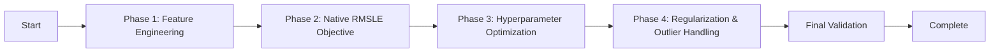

# Enhanced XGBoost Implementation Plan - Visual Overview

```mermaid
graph TD
    A[Enhanced XGBoost Model] --> B[Phase 1: Feature Engineering]
    A --> C[Phase 2: Native RMSLE Objective]
    A --> D[Phase 3: Hyperparameter Optimization]
    A --> E[Phase 4: Regularization & Outlier Handling]
    
    B --> B1[Physiologically Accurate MET]
    B --> B2[Additional Interaction Features]
    B --> B3[Polynomial Features]
    B --> B4[Feature Validation]
    
    C --> C1[Custom RMSLE Objective Function]
    C --> C2[Custom RMSLE Evaluation Function]
    C --> C3[Gradient/Hessian Validation]
    C --> C4[Performance Comparison]
    
    D --> D1[Bayesian Optimization]
    D --> D2[Cross-Validation Strategy]
    D --> D3[Parameter Search Space]
    D --> D4[Validation & Testing]
    
    E --> E1[Outlier Detection]
    E --> E2[Outlier Handling Strategies]
    E --> E3[Regularization Parameters]
    E --> E4[Robustness Validation]
    
    B1 --> F[High Priority]
    B2 --> F
    C1 --> F
    C2 --> F
    
    D1 --> G[Medium Priority]
    D2 --> G
    E1 --> G
    E3 --> G
    
    style F fill:#e1f5fe
    style G fill:#f3e5f5
```

## Priority Classification

### High Priority Items
- Physiologically accurate MET calculation
- Additional interaction features (HR_per_min, Weight_per_min)
- Native RMSLE objective implementation

### Medium Priority Items
- Polynomial features for non-linear relationships
- Better hyperparameter optimization with cross-validation
- Regularization parameters
- Outlier handling

## Implementation Flow

This implementation plan prioritizes the highest impact improvements first, allowing for incremental validation and performance measurement at each stage.